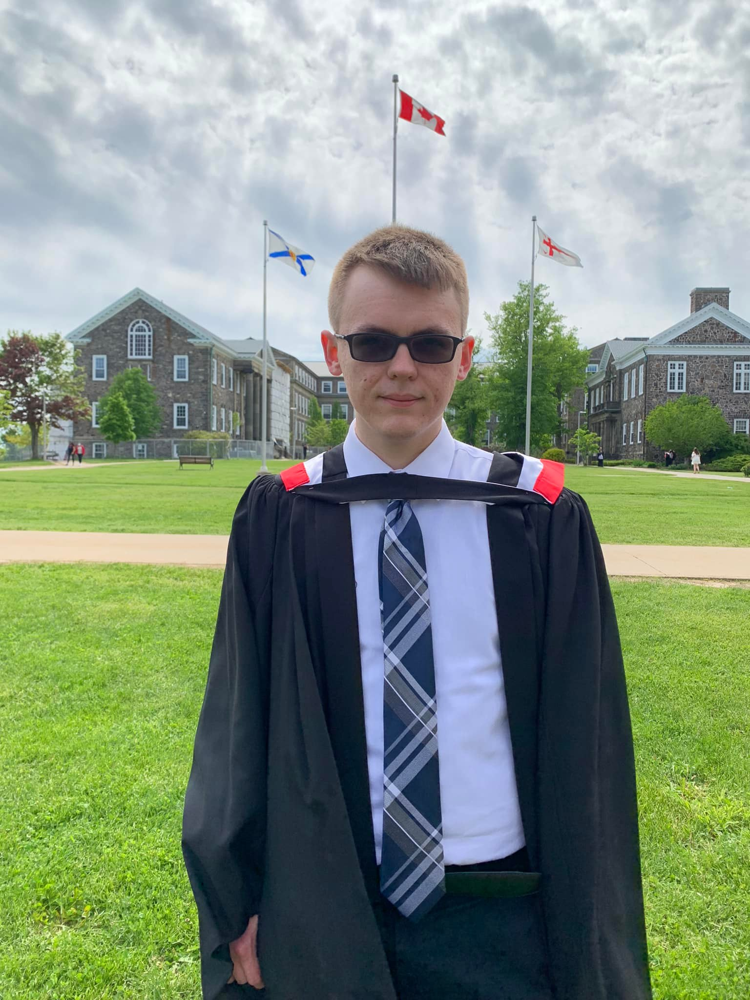

Last week, I graduated from Dalhousie University with a Bachelor of Science with First Class Honours in Psychology and Philosophy:

Since the convocation ceremony, I've been reflecting on my four years as an undergraduate. Overall, I was quite successful – my GPA is strong (especially from second year onwards), I obtained lots of research and volunteer experience, and I learned an immense amount from a handful of highly influential professors. With all this behind me, I was accepted to the Master's in Psychiatry Research program at Dal. I was also fortunate to win a national scholarship for the summer. Until September, I'm working with both my former honours supervisor and my future Master's supervisor. Not a bad position to be in if you ask me.

But alongside my successes, I made a number of mistakes. Fortunately, these mistakes have yet to incur any major costs. However, they're the kinds of mistakes that I know will incur some opportunity costs going forward. So, in the spirit of reflection I've been possessed with since graduation, I thought I'd share some of the things I did right and wrong. For the remainder of this post, I'll share three things I did right, and three things I did wrong. Hopefully if you are or will be an undergraduate, you can learn something from this. If you don't, then at least it'll be cathartic for me.

# Things I did right

## 1. STUDY PHILOSOPHY

Absolutely the best decision I made was to double major in philosophy. There are two reasons I have for believing this: first, because it gave me an invaluable set of skills; and second, because it vastly increased my background knowledge of psychology and science generally.

Philosophy taught me to think and write clearly. It did this in two ways: one was by teaching me to read critically. I developed a reading method which can be summarized in three steps: recollect, reflect, and respond. Recollection is about recalling what you read and paraphrasing it. Reflection is about jotting down related ideas/arguments. Response is about formulating new theses, arguments, and counterarguments directed at and against the material I just read. I've written about this method in greater detail in an essay for the Canadian Positive Psychology Association student branch, which you can find here. The general point is that you can't think or write clearly if you don't first read strategically. These critical thinking skills I've obtained made double majoring in philosophy the single best decision I made during my undergraduate degree. If you can think and write clearly, you'll go much further in the sciences.

Philosophy also greatly increased my knowledge of psychological science. I focused my psychology coursework in clinical, cognitive, and experimental psychology. Complimenting these courses, I focused my philosophical efforts in metaphysics, epistemology, and the history of philosophy. In the history of philosophy, I learned that there are almost no new ideas in any science, while gaining a profound appreciation for truly new ideas when we're lucky enough to find them. Most scientific theories are just empirical reiterations of old philosophical ideas. For example, our current conception of mental disorders in the Diagnostic and Statistical Manual of Mental Disorders can be traced back to the 20th century psychiatrist-turned-philosopher Karl Jaspers. His thought can be traced back to the 18th century philosopher Immanuel Kant. And finally, Kant's thought draws heavily on Plato and Aristotle. As for metaphysics and epistemology, they are the studies of fundamental reality and of knowledge, respectively. In both domains I learned about the origins and limitations of the scientific method. Science isn't perfect. Everyone knows it doesn't give us perfect knowledge. But, few know why it doesn't give us perfect knowledge, and even fewer are aware of the consequences of science's imperfections for their experimental paradigms. For example, how do we know the future will resemble the past, or that laws of nature will remain stable over time? Arguably, we don't. The problem of induction calls into question our ability to make inferences about the future, and there is yet to be an undisputed solution to this problem, despite having been recognized for over 300 years. If you can't know that the future will resemble the past – that the sun will rise tomorrow like it did today – then how the hell can you expect your experiments to tell you anything you can apply to the real world? Maybe you can't.

In short, philosophy will certainly help you think and write clearly. It may also give you valuable knowledge of your particular science and the scientific method more broadly. For both reasons, it was the right choice for me to double major in philosophy.

## 2. Find mentors and develop strong relationships with them

Aside from studying philosophy, the best decision I made early on was to seek multiple mentors. I searched specifically for non-paternalistic mentors. I think the best way to identify a non-paternalistic mentor is to find professors and graduate students who will allow and encourage you to disagree with their ideas. Such people will offer you more constructive feedback, because they're willing to have a stake in potentially being wrong and their student being right. This isn't to gloat and say I've been right almost every time – the opposite is closer to the truth. I've learned more from these kinds of people because they've graded me not on deriving the conclusion that matches their beliefs, but on my ability to think deeply about my own beliefs and reject them when I encounter my errors.

There are five professors who I've been incredibly fortunate to have as my closest mentors: Dr. Raymond Klein, Dr. Tyler Hildebrand, Dr. Michael Hymers, and Dr. Duncan MacIntosh. I began volunteering in Ray's lab in second year, and he eventually co-supervised me for my honours project. Ray is a "hands-off" mentor in the best sense: he lets students pick a lab-related topic to work on, and offers guidance strategically, only when it is absolutely necessary. Tyler, Dr. Hymers, and Dr. MacIntosh are all philosophy professors who let you pick the topic you want to write about, and give extremely detailed feedback on each and every idea. Even better, they mostly restrict students from using secondary sources, so that every paper has to be the product of your own deliberation. Then they help you explore your thoughts more by recommending further reading. I've had countless debates with all of these professors; their patience and generosity in this regard has been invaluable for my education.

## 3. Seek volunteer opportunities not because they'll beef up your resume, but because they'll teach you things you need to know

There are a lot of stupid, wasteful volunteer opportunities that you absolutely should not embark on simply because they will give you fancy titles to put on your CV/resume. I'm thinking mostly of bureaucratic positions – don't waste your time doing useless dirty work for other people. If you come across a volunteer opportunity where the primary reason for volunteering is your resume, run away from it and never look back.

Instead, look for opportunities that will give you skills you can advertise. Fancy titles sound cool, until an interviewer asks you for some concrete examples of skills you learned and problems you solved. The best opportunities I found for volunteering were in research and in science communication. In research, I participated in studies, co-managed a database, did literature reviews, analyzed data, and more. In science communication, I wrote blog posts (for my own website and for several others), co-founded a book club, and tutored over 70 second year psychology students in scientific writing. Even if you are volunteering purely to expand your resume, it will look a lot better to have a robust "Skills" section with example projects than a long list of phony titles from committees that never actually met or internships for companies that use students as a coffee delivery service.

# Things I should have done

## 1. Take more statistics classes

I tried to take only courses that would either (a) increase my knowledge in domains I was interested in and/or (b) afford me skills I needed to stand out and succeed. I was quite good at finding psychology and philosophy classes to fit these requirements, but I did not take enough statistics classes. I know the basics and I can use R fairly confidently, but statistics still feels like a major point of weakness.

I think my mistake was in taking too many psychology classes and not enough non-psychology statistics classes. For example, I took several third-year psychology classes that were a complete waste of time because I did not learn any skills or material applicable to my research interests. I was interested in these courses, but I am also interested in statistics. I should have prioritized stats. Also, I say "non-psychology statistics classes" because I found out quite late into my degree that there are still misapplications of statistical techniques in psychology textbooks that stem from the replication crisis. For example: should you run pilot studies to estimate effect sizes for power analyses? Many of my psychology professors would say yes, but unfortunately it is no so straightforward. At small sample sizes, you're actually more vulnerable to overestimating the effect size – as Andrew Gelman explains, pilot studies ought to be for sorting out problems with your study design, not to collect data for effect size estimation. If you overestimate your effect size based on a pilot study, then your power calculations will probably spit out a sample size that is actually too small. This is just one example of the statistical errors unfortunately endemic to psychology, so I wish I had taken more statistics classes outside of those offered in the psychology department.

## 2. Take summer courses in first and second year to avoid heavy course loads in third and fourth year

Okay, this one is less of a mistake and more of a crappy thing that happened but which was outside my control. But it may not be outside of yours. I'll explain why.

My original plan was to take 5 courses per semester in first and second year, and then four courses per semester in third and fourth year. I intended to take the additional four required courses during the summers between first and second year, and second and third year. That way, I could finish in four years while leaving my last two summer breaks for research experience. Unfortunately I ended up taking five courses per semester in my final year. The reason was that I tried to take courses last summer (between third and fourth year), but I was hospitalized with post-vaccine myopericarditis and left unable to work for the rest of the summer. So, I had to drop the summer courses. This wouldn't have happened had I planned sufficiently to take courses in the summer between first and second year. But at that point I didn't know you could take summer courses at other universities (Dal's summer course offerings are pretty sparse).

If you want to finish in four years and not be stretched too thin in third and fourth year, then you should try to take two summer courses in each summer preceding those years. Of course, you could just do an extra semester or even an extra year. I just didn't want to.

## 3. Make room for life outside of school

I worked too hard in university, and I don't say that with pride. I could have worked smarter rather than harder, like by taking a light summer course load. Instead, I burnt myself out numerous times by committing to too many volunteer activities and classes.

But beyond working too hard, I also expected school to be a source of value sufficient for a sense of purpose – it just isn't. There were three primary sources of value I neglected or otherwise did not get enough of:

The first is music. I've been playing guitar since I was 10 years old. Currently, I play in a funk rock band. Both my over-commitment to school and the pandemic's destruction of the local music scene prevented me from pursuing music as much as would have been good for me.

The second is fitness. Actually, for the first two years of my degree, I was highly committed to eating well and going to the gym, and it paid off. But two things changed that caused a disruption in my fitness journey: first was the pandemic, and second was post-vaccine myopericarditis. When the pandemic came along, I made the mistake of trying to drown it out by going all out on my studies. I should have used that as an opportunity to discover new fitness activities I could do outside of the gym until they re-opened. But again, I assumed school to be my sole source of value in life and therefore failed to adapt my fitness routines. In the summer of 2021, however, I started doing calisthenics at a local playground and got quite good at it. That is, until I was hospitalized with post-vaccine myopercarditis, which may have left me with permanently reduced heart function (I'll find out for sure in followup cardiac testing next year). I literally only returned to the gym yesterday. I could've returned in late March, except I was so anxious about the heart issues that I couldn't bring myself to exercise. I didn't realize until a couple weeks ago that this anxiety was crippling my return to exercise. I tried to drown out my anxiety by working the hardest I have ever worked in school, and that only made it worse. Again, the same mistake: thinking that school is a perfect source of value.

The third and most important source of value I didn't get enough of is in my social and family life. If there's one thing isolation during the pandemic taught us all, it's that we need regular social interaction to stay sane. I was isolated by my over-commitment to academics before COVID, but not to a large enough degree to realize isolation was a major cause of the depression I'd been struggling with for years. I am literally terrified by the extreme darkness that came over me in the spring and summer of 2020. I truly never knew I could feel that horrible, and I tried to escape it again by hyper-focusing on schoolwork. I had three big moments of escape from this depression: once when my niece was born in the summer of 2020, another when Dal returned to in-person learning last fall, and again when the government lifted travel restrictions and I returned to St. John's to visit family in February. In every case, I found that I needed interaction with others.

Don't use school as an escape. School is a source of value, not the only source of value. An over-commitment to school will not be enough to cope with deprivation of other necessary sources of value.

# Concluding thoughts

These have been the most meaningful four years of my life. I studied what I wanted to study alongside like-minded students, professors, and friends. Luckily, I think I made far more right decisions than wrong ones, and the mistakes are ones I've learned from. I've often heard people say that they wish they could be in high school again. I disagree; I hated high school – I even had nightmares where I was forced by some new educational rules to return to high school part-way through university! But unlike high school, and despite the challenges brought forth by COVID-19, I look back on these four years fondly. Thanks to everyone – friends, family, colleagues, and mentors – for everything you did to give me the most out of these four years.

I can't sign off as a "rambling undergraduate" anymore, and "rambling graduate" just doesn't have the same humorous quality to it. So for now, I'll just say:

Until next time,

Nicholas Murray